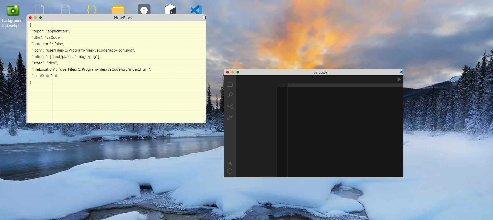
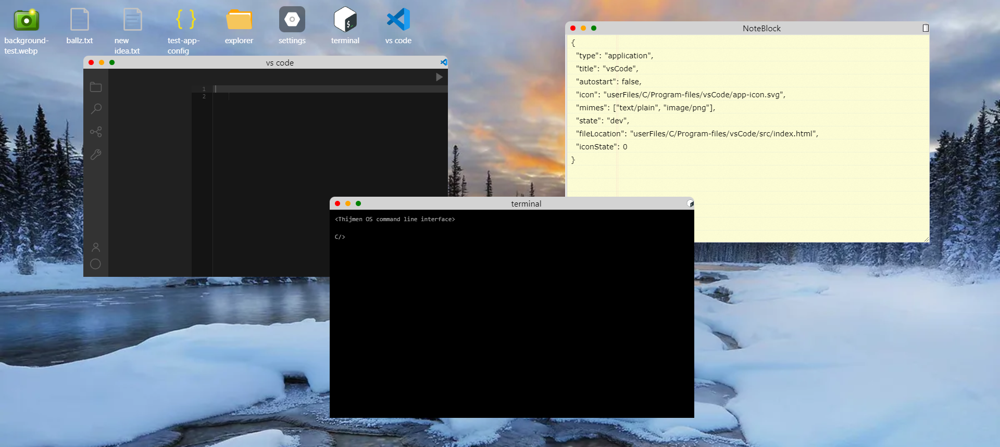

# ThijmenOS

> **NOTE: ThijmenOS is een project in ontwikkeling en deze documentatie kan ieder moment veranderen**

ThijemOS is een virtieel maar volledig functionerend oparating systeem in de browser. Het is geschreven in HTML, css en typescript. Met volledig functionerend bedoel ik een oparating systeem met een kernel, applicatie, notificaties, permissies, geheugen, opslag, etc.

Het project begon met het idee om een operating systeem idee portfolio website te make waar iedere sectie van de portfolio een apparte applicatie was. Vervolgens wilde ik een aantal easter egg applicaties maken wat uit de hand liep. Dit begon met snake, toen werd het een VS-Code clone applicatie waar ik javascript code mee wilde kunnen runnen. maar daar kwam een veiligheids risico bij kijken, mensen moest natuurlijk geen malisious code uitvoeren. Dus ik ging kijken naar hoe ik veilig deze code kon uitvoeren en kwam op een iframe. Maar als mensen toch al javascript in een iframe kunne runnen, waarom dan ze niet ook hele applicaties laten maken. En zo is het idee uitgegroeid tot een volledig operating system.

## Component structuur

ThijmenOS bevat verschillende packages die een stuk functionaliteit leveren aan andere componenten. Deze packages zijn bijvoorbeeld de graphics provider welke graphische functionaliteiten levert aan bijvoorbeeld de prompt provider en de client.

De packages binnen het project zijn als volgt:

- [ThijmenOS-Client (Client core)](https://github.com/ThijmenOS/ThijmenOS-client)
- [ThijmenOS-Server( servercore)](https://github.com/ThijmenOS/ThijmenOS-server)
- [ThijmenOS-Common(Common types en methoden in alle packages](https://github.com/ThijmenOS/ThijmenOS-common)
- [ThijmenOS-Graphics (Graphics methoden)](https://github.com/ThijmenOS/ThijmenOS-graphics)
- [ThijmenOS-Prompt (User prompts implementatie)](https://github.com/ThijmenOS/ThijmenOS-promptManager)
- [ThijmenOS-ErrorManager (Error handler)](https://github.com/ThijmenOS/ThijmenOS-errorManager)
- [ThijmenOS-Eslint (Eslint &amp; typescript configuratie)](https://github.com/ThijmenOS/ThijmenOS-eslint)
- [ThijmenOS-PackageUtils (CLI services)](https://github.com/ThijmenOS/)

### Package walktrought

Zoals hierboven genoemd zijn er verschillende packages. Deze packages leveren een stuk functionaliteit. In dit stuk lopen we door de packages heen, wat ze in grote lijnen doen en hoe ze met elkaar verbonden zijn.

> **NOTE:** Voor meer informatie over de packages zie de package repo zelf

#### ThijmenOS-Client

De client package is het hart de OS. Deze package zorgt namelijk voor een groot deel van de functionaliteit zoals het tonen van de applicaties, het afhandelen van applicatie requests door de kernel, het mogelijk maken van gebruikers interactie, bijhouden van RAM en nog veel meer.

De client maakt gebruik van de Common package voor verschillende types.

Daarnaast gebruikt het de Graphics package om het process van het renderen van de UI te versimpelen, zo krijgt het door deze package toegang tot methoden zoals het gemakkelijk toevoegen van een element aan een ander element, of het toevoegen van meerderen klassen en attributen aan een element in een keer.

Ten derde maakt de client gebruik van de Propt package om interactie met de gebruiker te hebben. Wanneer er bijvoorbeeld een applicatie niet is gevonden regelt de prompt package dat de gebruiker dit duidelijk te zien krijgt. of wanneer een applicatie toegang wil tot een permissie regelt de prompt package dat de gebruiker een keuze kan maken of hij dit toe staat.

Ten slotte word er gebruik gemaakt van de ErrorManager om errors af te handelen. Bijvoorbeeld wanneer er een fatale error voorkomst zoals het niet kunnen laden in instellingen zorgt de error manager er voor dat er een bluescreen komt of wanneer er iets anders aan de hand is zorgt de error manager dat dit correct word afgehandeld.

#### ThijmenOS-Server

De server zorgt voor alles wat te maken heeft met de fysieke harddrive. Het zorgt er voor dat bestanden gemanipuleerd en gelezen kunnen worden, maar ook dat applicatie code door de client opgehaald kan worden om te renderen. Ten slotte regelt het ook alle instellingen die langer bewaard moeten worden. Wanneer er bijvoorbeeld een permissie word toegekent aan een applicatie zorgt de server ervoor dat deze informatie voor de volgende keer onthouden word.

De Server package maakt enkel gebruik van de Common package om typen in sync te houden met de client code. Zo weet je in biede packages gemakkelijk welk datatypen er word verwacht en meegegeven kan worden.

#### ThijmenOS-Common

Common zorgt er voor dat typen en methoden gebruikt kunnen worden door iedere package die ze nodig heeft.

#### ThijmenOS-Graphics

Graphics maakt het manipuleren van de DOM gemakkelijker voor andere packages. Zo levert het methoden om elementen te vinden, te maken, een element toe te voegen aan een ander, etc

De graphics package maakt gebruikt de common package om configuratie opties te weten.

#### ThijmenOS-Prompt

De prompt package levert informatie en keuze modals aan de client package. Bijvoorbeeld om permissies toe te kennen of om te vragen welke applicatie gebruikt moet worden om een bestand te openen.

De prompt package maakt gebruik common om typen te gebruiken zoals de permissies

Daarnaast gebruikt prompt de grapgics package om het gemakkelijker te maken om het gedrag van de elementen te manipuleren en het te renderen op het scherm.

#### ThijmenOS-ErrorManager

De error manager regelt alle errors die er onstaan in de processen. Wanneer er een error ontstaat word de error manager gebuikt om de error op een goede manier af te handelen. Dit kan bijvoorbeeld zijn dat er een blue screen komt, dit kan zijn de het gelogd word maar het process correct kan door werken of dat de gebruiker geinformeerd word.

Om de gebruiker te informeren maakt de errormanager gebruik van de prompt package. er word dan een prompt gebruikt om het te tonen aan de gebruiker.

Daarnaast gebruikt de errormanager de graphics package om het gemakkelijker te maken om bijvoorbeeld die bluescreen te renderen.

En ten slotte word er gebruik gemaakt van de common package om bijvoorbeeld de verschillende error typen te delen tussen de client, de server en de errormanager

#### ThijmenOS-Eslint

Deze package bevat configuratie voor code standaarden en typescript configuraties. Dit is om consistentie tussen packages te garanderen en gemakkelijker te maken.

Deze package word door iedere andere package gebruikt.

## Installatie

Het project is not niet klaar voor een productie of development distributie

## Auteur

- [@ThijmenBrand](https://github.com/ThijmenBrand)
